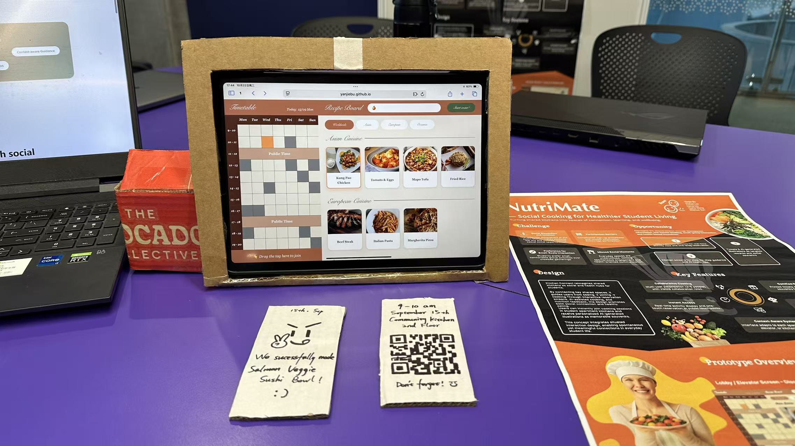

# NutriMate – Design Process Overview

**Prototype and Materials**

- [Interactive Prototype](https://3500prototye.netlify.app)
- [Poster](../Documentation/prototype_evaluation/Exhibit/3500_poster.svg)
- [Prototype Design](../Documentation/Iteration2/prototype.md)
- [Intro Website](https://3500introwebsite.netlify.app/)

**Documentation**

- Iteration 1
  - [Interview Analysis](../Documentation/Iteration1/Interview_Analysis.md)
  - [Design Proposal](../Documentation/Iteration1/Refine_Proposal.md)
  - [Design Proposal Evaluation](../Documentation/Iteration1/Design_Proposal_Evaluation.md)
- Iteration 2
  - [Interview Analysis](../Documentation/Iteration2/Interview_and_Observation_Findings.md)
  - [User Needs, Pain Points, and Expectations](../Documentation/Iteration2/User_Needs_Pain_Point_Expectations.md)
  - [Design Prososal](../Documentation/Iteration2/Proposal_V2.md)
- Prototype Evaluation
  - [Exhibit](../Documentation/prototype_evaluation/Exhibit.md)
  - [Prototype Evaluation Summary](../Documentation/prototype_evaluation/Prototype_Evaluation.md)
  - [Future Work](../Documentation/prototype_evaluation/Future_Plan.md)
- Other Materials
  - [Detailed Design Process](Wiki_Home.md)
  - [Ethical Considerations](ethical_considerations.md)  

---

## Concept Poster

---

## Summary: Problem & Opportunity Space  

**NutriMate** was designed to transform **shared student kitchens** into inclusive, social, and culturally engaging spaces.  
Research showed that dormitory residents, especially international students who often feel **isolated** due to shyness, cultural differences, and limited kitchen confidence.  

Our opportunity lay in reframing the kitchen from a **private, awkward space** into a **communal social hub**, where cooking becomes a low-barrier way to connect.  

**Design Challenge:**  
How might we enable students to form meaningful social connections through shared cooking experiences, using both physical and digital touchpoints?

---

## FOUNDATION  

### Motivations, Aims & Outcomes

- **Motivation:** Address loneliness and disuse of shared kitchens.  
- **Aim:** Use food and cooking as social entry points to encourage belonging.  
- **Outcome:** A **hybrid digital–physical system** encouraging both planned and spontaneous cooking events.

### Inspiration

Starting from [interview](../Documentation/Iteration2/Interview_and_Observation_Findings.md), drawing on social computing precedents and location-based interaction theory, we examined:

- Food as a **universal social bridge**.  
- The role of **spatial visibility** (e.g., bulletin boards, displays) in inviting participation.  
- **Previous examples** such as recipe walls and QR-based event boards.  

### Site

Our chosen site, the **student dorm kitchen**, is semi-public and emotionally charged: familiar, yet socially uncertain.  
Mapping movement and observation identified **three zones for engagement**:

1. **Lobby & Elevator** – discovery of events.
2. **Kitchen Entry** – decision and scanning.  
3. **Cooking Area** – participation and bonding.  

### People

**Users:**
Students in shared accommodations, especially internationals seeking community.

**Methods:**

- Semi-structured [interviews](../Documentation/Iteration2/Interview_and_Observation_Findings.md).  
- Observations of real kitchen use.  
- Prototype co-testing sessions in pairs.  

Insights showed that **students valued social cooking over food quality**, but feared judgment or awkwardness.  

### Resources

The project used low-cost, context-aware resources:  

- Dorm bulletin boards and displays.
- Printable recipe cards and QR codes.  
- A browser-based mini-program for ease of access.  

---

## THE EXPERIENCE ITSELF  

### Theme & Narrative

The guiding theme, **“Cook Together, Connect Together,”** reframes meal preparation as cultural storytelling.  
Users embark on a **four-stage journey**:  
**Reserve → Scan → Cook → Celebrate**.  

Each step links place, people, and action to sustain participation beyond the meal itself.  

### Nodes (Interaction Points)

- **Physical:**  
  - *Recipe Wall* – Post hometown dishes and QR links.  
  - *Event Board* – Announce weekly themed cook sessions.  
  - *Ticket Printer* – Creates personalized participation tokens.  
- **Digital:**  
  - *Mini-Program* – View events, register, or find cooking buddies.  
  - *Community Feed* – Share post-event photos and reflections.  

### Trajectory (User Journey)

1. **Discovery:** Notices event posters in the lobby.  
2. **Engagement:** Scans QR → joins or bookmarks an event.  
3. **Preparation:** Receives ingredient list and event details.  
4. **Participation:** Cooks together guided by on-screen prompts.  
5. **Reflection:** Shares moments and receives an AI-generated souvenir image.  

This cyclical journey encourages **re-entry and sustained engagement**.  

### Tools

- **Hybrid Interaction:** QR codes linking event posters to digital interfaces.  
- **AI Integration:** Nutritional analysis and recipe recommendations.  
- **Design Artifacts:** Posters, kitchen signage, physical souvenirs.  
- **Methods:** Observations, think-aloud protocols, and follow-up interviews.  

### Public Face

NutriMate’s visual identity emphasizes **warmth and inclusivity** through organic shapes and food-inspired colors.  
At exhibition, a **live kitchen simulation** demonstrated the booking → cooking → souvenir journey, supported by posters and the prototype.  

  
*Figure. The final exhibit setup*  

---

## [Evaluation](../Documentation/prototype_evaluation/Prototype_Evaluation.md) with Users  

**Goal:** Understand how NutriMate supports or hinders social interaction.  

**Participants:** 6–8 international students in dorm-like settings.  
**Method:** Mixed-method formative evaluation with scenario walkthrough, observation, and post-interview.  

### Key Findings

| Finding | Issue | Design Response |
|:--|:--|:--|
| Lack of booking feedback | Uncertainty after registration | Add confirmation ticket + cancel option |
| Unclear preparation info | Users unsure what to bring | Include “Preparation Tips” in event page |
| Social discomfort | Users focused more on system than people | Embed social prompts in task flow |
| Preference for small groups | Overcrowding reduced comfort | Add “Join with a friend” feature |
| Missed post-event connection | Experience ended abruptly | Introduce post-event reflection wall |

**Result:** Iterative refinements created a smoother digital–physical transition and enhanced comfort for small-group participation.  

---

## [Reflection](../Documentation/prototype_evaluation/Future_Plan.md)  

Applying the **Design for Location framework** helped keep our design contextually grounded:

- **Foundation:** revealed the social and environmental barriers to kitchen use.  
- **Experience:** structured how physical spaces could become **stages for connection**.  
- **Public Face:** shaped an inclusive visual identity that communicates warmth and accessibility.  

Through continuous iteration and testing, NutriMate became not only a **social system**, but a reflection on **how design for place** can transform mundane environments into sites of belonging.  

---

## Team Contributions  

| Member | Role | Contribution |
|:--|:--|:--|
| **Yinhan Liu** | UX Researcher & Interface Designer | Led user interviews, synthesized insights, and shaped the booking interface. |
| **Yanjie Bu** | Team Leader & Interaction Designer | Led project planning and research, created low-fidelity, interactive, and paper prototypes, and joined testing. |
| **Yuzhe Wang** | Research Analyst & Evaluation Designer | Planned evaluation methods, analyzed findings, and guided redesigns. |
| **Hanqi Liu** | Interaction Designer & Project Steward | Coordinated design documentation and maintained design consistency. |
| **Shizhuo Sun** | Prototype Developer & UX Researcher | Built interactive prototype, conducted usability testing, and integrated AI features. |

---

## Conclusion  

By integrating social computing principles, interactions, and cultural inclusivity, NutriMate turns shared kitchens into living social spaces, encouraging students not just to eat together, but to **belong together**.  

---

## References

1. Loke, L. & Matthews, B. (2020). *Design for Location: Locating Design through Places, Practices and Pedagogies.*
