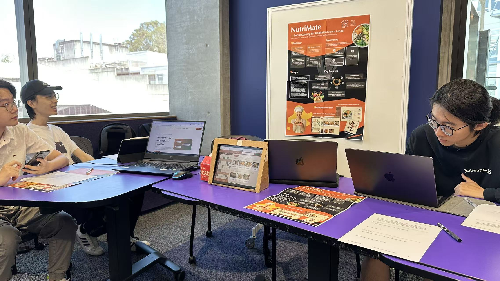

# Exhibit

## 1. Overview

The **Exhibit** marks the final stage of our project, where we publicly showcased the *NutriMate* prototype to peers, instructors, and visitors.
The exhibition provided an opportunity to communicate our design concept, demonstrate interactive features, and collect real-time feedback from a wider audience.

Our goal for this stage was to:

* Present the complete user journey from **booking → participation → reflection**,
* Engage participants in an **interactive demonstration**, and
* Gather **new insights** about the usability, social interaction, and communication aspects of the prototype in an open setting.

---

## 2. Preparation

### Poster

To complement the digital presentation, we designed a poster.  
The poster visually summarized the system’s concept, motivation, and design process, serving as an engaging introduction during the exhibition.

**Poster Highlights:**

* **Challenge & Opportunity:** Addressed key issues including *social discomfort*, *missed social moments*, and *participation barriers* in shared kitchens.
* **Design Features:** Illustrated the core system — lobby/elevator screens for real-time reservations, kitchen displays for collaborative cooking, and printed AI-generated souvenirs.
* **Interaction Focus:** Highlighted the importance of low-barrier participation, small-group collaboration (3–5 people), and real-time engagement through context-aware interfaces.

The poster played a central role in capturing attention during the exhibit, quickly communicating NutriMate’s value proposition and encouraging visitors to try the prototype in person.

### Intro Website

To effectively communicate the project concept, we created an introductory website serving as a promotional and explanatory platform.

The website presented:

* **Project concept and motivation** – addressing social isolation and participation barriers in shared student kitchens.
* **Design process** – summarizing our research, prototyping, and evaluation phases.
* **System features** – including the booking interface, cooking assistant, and AI-generated illustration module.
* **Visual demonstration** – You can view our prototype through the website.

This preparation ensured that visitors could explore the idea even before interacting with the physical prototype.

---

## 3. Exhibition and Presentation

During the exhibit, the entire team actively participated in:

* **Setting up the prototype display**, combining the prototype screen, printed ticket function, and intro website.

* **Delivering live demonstrations**, showing how users can book, cook, and print souvenirs.
* **Engaging in discussions** with peers and visitors to explain the design goals and research background.
* **Answering Q&A sessions** from tutors and other participants, emphasizing the social design and iterative development process.

The interactive setup attracted attention and encouraged participants to try the system themselves, simulating the experience of a shared cooking event.

---

## 4. Audience Reactions and Feedback

Visitors and instructors appreciated the project’s:

* **Holistic design** connecting physical and digital experiences, and
* **Clear connection to real social challenges** in student housing environments.

However, several feedback points emerged during the exhibit:

1. **Unclear Physical Flow** – A few people were unsure about how the “booking–cooking–printing” sequence works in a real environment without guidance.
2. **Scalability Concerns** – Questions arose about how the system could handle multiple groups or larger kitchens simultaneously. Some pointed out the current system lacks a function that allows users to upload their own activities.

These insights complement the findings from our formal evaluation and will inform potential future refinements.

---

## 5. Reflection and Learning Outcomes

Through the exhibition, the team gained valuable experience in:

* Translating research and prototypes into communicable public artifacts;
* Managing real-time audience interaction and feedback;

The exhibit also revealed the importance of:

* Simplifying communication materials for non-technical audiences;
* Preparing visual aids and physical artifacts that reinforce the story;
* Observing spontaneous reactions as a natural extension of evaluation.
