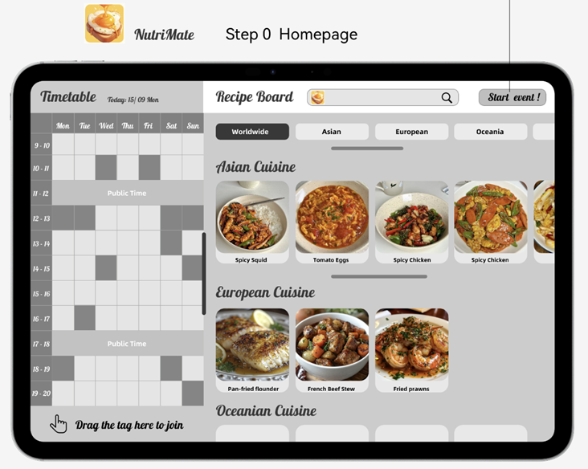
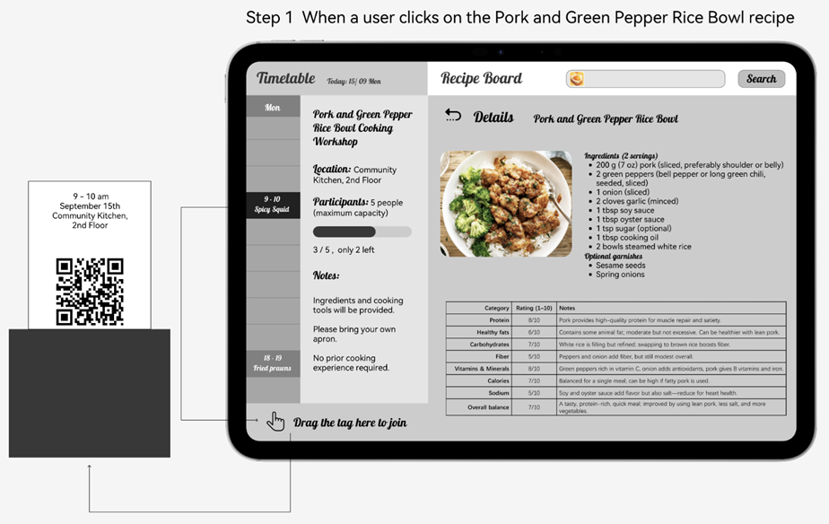
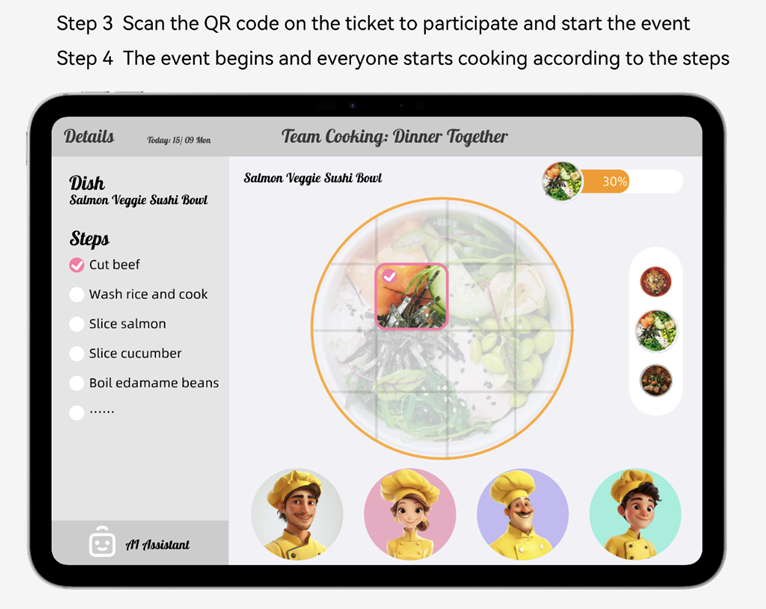
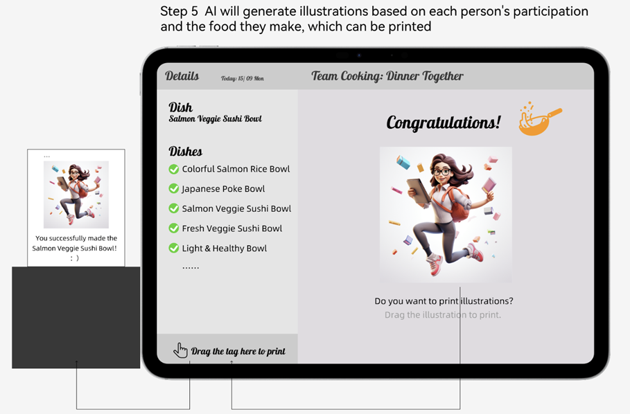
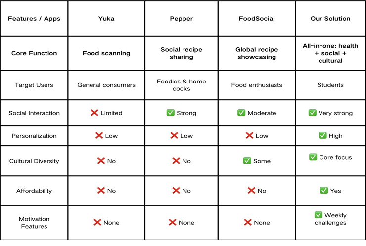

# Prototype

1. **Homepage**
    - **Weekly Timetable**: Shows all cooking events for the week in one view.
    - **Cuisine Categories**: Events are grouped by continent (Asian, European, Oceanian, Worldwide………).
    - **Search Bar**: Quickly find recipes or events.
    - **Start Event Button**: Participants scan their tickets here to begin the activity.

2. **Activity Details Page**
    - **Daily Timetable**: The weekly view changes to a single day, with the selected event clearly highlighted.
    - **Event Information**: Shows the activity’s time, location, participant capacity, and remaining spots.
    - **Recipe & Health Analysis**: The chosen recipe is displayed with ingredients, steps, and AI-based nutrition ratings.
    - **Interactive Ticket**: Users drag the highlighted event tag to the outlet to print a physical ticket with a QR code, required for joining the activity.

3. **Cooking Process Page**
    - **Steps Panel**: Displays the dish and step-by-step instructions; participants check off steps as they complete them.
    - **Visual Progress**: The dish image gradually fills with color, showing overall completion percentage.
    - **AI Assistant**: Provides real-time health tips, cooking guidance, and reminders for each step.
    - **Participant Avatars**: Show who is involved, making roles and collaboration more visible.
    - **Interactive Flow**: Combines progress tracking, guidance, and teamwork to create an engaging cooking experience.

4. **End Event Page**
    - **Completion**: Confirms the dish is finished and shows a “Congratulations” message.
    - **AI Illustration**: AI generates personalized illustrations based on participation or health data.
    - **Souvenir Printing**: Users can drag the illustration to the print outlet to receive a physical copy.
    - **Memorable Reward**: Printed illustrations serve as fun souvenirs of the cooking activity.

---

# Functional Prototype Progress

## Implemented Functionalities

- **Public Kitchen Reservation**: Users can complete reservations on the lobby or elevator screen with a single drag.
- **Activity Info & Health Index**: By clicking an activity, users can view participant numbers and health index information, helping students understand the relationship between diet and health.
- **Cooking Instructions in Kitchen**: The kitchen screen displays relevant cooking information, assisted by the AI helper.
- **Illustration Generation & Printing**: The AI generates illustrations based on participation and other related information, which can be printed out from the kitchen printer.
- **Ticket Printing**: After a successful reservation, users receive a ticket with a QR code, which is used for scanning and task allocation in the kitchen.
- **AI Assistant Support**: The AI is used for food health index analysis, cooking assistance, information queries, and generating illustrations based on the information.

## Core Interaction Flow

- **Reservation Stage**: Screen → Select Activity → View Participants & Health Index → Drag to Reserve → Print Ticket
- **Activity Stage**: Enter Kitchen → Scan Ticket → Cooking Steps on Screen → AI Provides Health Tips & Cooking Guidance → Human-Technology Interaction During Cooking (e.g., interface puzzles) → Participants Collaborate to Complete Dishes
- **Completion Stage**: Cooking Finished → AI Generates Illustration (based on participation or health data) → Printer Outputs Illustration → Participants Receive Physical Souvenir

## Features Still Under Development

- **Public Kitchen Reservation**: Users can complete reservations on the lobby or elevator screen with a single drag.
- **Fun Human-Technology Interactions in Kitchen**: Interesting interaction modes between participants and technology in the kitchen (e.g., gesture recognition, sensor-triggered dynamic feedback) could be further developed.
- **Expanded Health Feedback**: The AI assistant will provide personalized health suggestions in the future, not limited to scoring.
- **Personalized Illustrations**: Provide personalized services based on user preferences, like style and colour.

---

# Prototype Evaluation

